# AI 小说创作工作台 / AI Novel Production Engine
一个面向长篇小说创作的 AI Native 开源项目。

当前开发主线：
`Creative Hub + 自动导演开书 + 整本生产主链 + 写法引擎`


## ✨ 项目简介

这是一个**面向长篇小说的 AI 生产系统**。

它不再是“你写一句，AI补一句”的聊天模式，而是：

- 👉 从一个想法出发
- 👉 自动构建世界观、人物、剧情结构
- 👉 管理知识与设定（RAG）
- 👉 控制写作风格与叙事一致性
- 👉 最终生成完整章节甚至整本小说


## 项目定位

很多 AI 写作工具的使用方式其实差不多：
- 你输入一句 Prompt
- 它回你一段正文
- 不满意就重试
- 写短篇还行，写长篇容易越写越散

这个仓库是“AI 导演式长篇小说生产系统”，而不是传统的写作聊天壳子。

它最核心的产品判断是：

- 目标用户优先是完全不懂写作的新手，而不是熟悉结构设计的资深作者。
- 优先解决“如何把整本书写完”，再逐步优化“写得多精巧”。
- AI 不只是一个补全文本的模型，而是参与规划、判断、调度、执行和追踪的系统角色。

如果你正在找的是下面这种项目，这个仓库会更值得关注：

- 想验证 AI 是否真的能参与整本小说生产，而不是只写单段文案。
- 想研究 AI Native Product、Agent Workflow、LangGraph 编排怎样落到真实创作业务。
- 想把世界观、角色、拆书、知识库、写法控制和章节生成串成一套稳定工作流。


## 现在已经能做什么

### 1. AI 自动导演开书

- 可以从一句模糊灵感直接进入自动导演，不必先自己把世界观、主线、角色和卷纲全想完；系统会先整理项目设定、对齐书级 framing，再生成多套整本方向和对应标题组。
- 方案选择不再只是“满意就确认、不满意就整批重来”。如果第一轮方向不够准，可以继续生成下一轮；如果已经偏向某一套，也可以只让 AI 修这套方案，或者只重做这套的标题组。
- 自动导演创建时已经支持三种推进方式：`按重要阶段审核`、`自动推进到可开写`、`继续自动执行前 10 章`。对应链路会把书级方向、故事宏观规划、角色准备、卷战略、节奏拆章和章节执行接成一条连续流程。
- 这条链路已经支持检查点恢复、现有项目接管、页内继续推进和换模型重试。到 `front10_ready` 之后，不仅能直接进入章节执行，也可以继续让 AI 自动执行前 10 章的写作、审校和修复。
- 自动导演里的角色阶段也不再无条件把第一套阵容直接落库。现在会优先生成可直接进入正文的人物资产；如果角色名仍像功能位、缺少身份锚点或质量不够稳定，系统会停在角色审核点，而不是继续把坏阵容带进后续卷规划和拆章。

### 2. Creative Hub 与 Agent Runtime

- `Creative Hub` 现在已经不只是一个聊天页，而是在往统一创作中枢收：对话、追问、规划、工具调用、执行状态和回合总结都在往这里并。
- 系统里已经有了比较明确的 Planner、Tool Registry、Runtime、审批节点、状态卡片和中断恢复链路，说明这个项目现在关注的已经不是“AI 会不会写字”，而是“AI 能不能组织一条真实的创作工作流”。
- 如果你关心的是 AI Native Product 怎么落地，这一块已经不是零散按钮拼盘了，而是开始长出一套值得继续往下做的骨架。

### 3. 整本生产主链

- 单章运行时、章节执行和整本批量 pipeline 现在都在往同一条主链上收，不再是“这里一个试写入口，那里一个批量按钮”的割裂状态。
- 已经可以从结构化规划、章节目录和资产准备状态出发，启动整本写作任务，并持续查看当前阶段、失败原因和下一步建议。
- 它当然还不是那种完全不用管的一键出书机，但也已经不是“只能演示几张截图”的阶段了，至少主链是真的能往前推。

### 4. 写法引擎

- 写法现在不再只是提示词里的一段长说明，而是可以保存、编辑、绑定、试写和复用的长期资产。
- 可以从现有文本里提取写法特征，并把原文样本一起保存下来，后面不是只能靠记忆去猜“当时那个味道到底怎么来的”。
- 提取出来的特征会沉淀成可见特征池，进入编辑页以后可以逐项启用、停用和组合，写法规则也会跟着同步重编译，便于后续试写、修正和整本绑定。
- 这意味着写法引擎现在已经开始真的参与生成、检测和修正链路，而不是一个摆在侧边栏里的概念功能。

### 5. 世界观、角色、拆书、知识库联动

- 世界观已经不只是大段设定文本，而是支持创建、分层设定、快照、深化问答、一致性检查和小说绑定的结构化资产。
- 角色体系也不再只是静态角色卡，已经开始往动态角色资产走，会把关系阶段、卷级职责、缺席风险和候选新角色一起带进后续规划与生成。
- 拆书结果可以继续发布到知识库，再回灌到续写、规划和正文生成；知识库本身也已经支持文档管理、向量检索、关键词检索和重建任务追踪。
- 换句话说，这一块现在已经开始像“长期记忆系统”，而不是做完一次设定就丢在那里的资料堆。

### 6. 模型路由与本地运行

- 已经支持 OpenAI、DeepSeek、SiliconFlow、xAI 等多提供商配置，规划、正文、审阅这些链路可以按路由拆开配。
- 前后端已经完成 Monorepo 拆分，适合本地持续开发，也比较适合继续往 Prompt Registry、Workflow Registry 和 Runtime 这条路上扩。
- 默认使用 SQLite 就能把主链先跑起来；如果你要完整体验知识库 / RAG，再按需接 Qdrant 就行，不需要一上来就把所有基础设施堆满。


## 典型使用路径

1. 在小说创建页输入一句灵感，先让 AI 自动导演给出整本方向候选。
2. 进入 `项目设定`，先把题材、卖点、目标读者感受和前 30 章承诺定下来。
3. 用 `故事宏观规划`、`角色准备` 和世界观资产，把整本主线、角色网和世界边界补到能写。
4. 进入 `卷战略 / 卷骨架` 决定怎么分卷，再到 `节奏 / 拆章` 把当前卷落到章节列表和单章细化。
5. 按需绑定拆书结果、知识库文档和写法资产，让后续正文不只是靠一次性提示词。
6. 进入 `章节执行` 逐章写作、审计、修复，必要时回到卷工作台做再平衡和重规划。
7. 想加速推进时，再启动整本生产任务，持续查看状态、失败原因和回灌结果。

## 当前长篇生成能力支撑图


- 开书定盘负责先把这本书“要写成什么样”说清楚，避免后面越写越散。
- 整本控制层和卷级规划层负责把长篇拆成可推进、可回看、可调整的结构，而不是一次性写死。
- 角色、世界观、写法、知识库和质量控制一起托住单章生成，让每一章都尽量还在同一本书里。
- 每写完一章，系统都会把新状态回灌回去，继续影响后续章节、卷级节奏和必要时的重规划。

## 最近进展

### 2026-04-02

重大更新：自动导演现在不只会把新项目推进到“可开写”，还支持接管已有项目，并可继续自动执行前 10 章的写作、审校和修复链路。

- 自动导演的候选阶段改成了更完整的书级方案生成流：系统会先整理项目设定、对齐书级 framing，再产出两套整本方向和对应标题组；如果你已经偏向某一套，不必整批重来，可以直接让 AI 只微调这套方案，或者只重做这套的标题组。
- 已有小说现在可以显式交给自动导演接管。系统会先判断故事宏观规划、角色准备、卷级策略和结构化大纲的就绪度，再从更合适的阶段接手，减少“前面已经做了一半却只能重开”的浪费。
- 当自动导演把第 1 卷推进到可开写后，你现在可以选择继续让 AI 自动执行前 10 章；编辑页会同步展示运行中、暂停点和恢复入口，也会在需要时把你直接带到章节执行或质量修复区域。
- 章节执行和审校链补强了参与角色识别、分层上下文、卷内标题多样性和复盘提示，前 10 章连续自动推进时更不容易出现角色遗漏、标题过于相似或审校结果空转的问题。
- 自动导演里的角色准备现在会优先产出可直接进入正文的人物，而不是“谜团催化剂”“导师位”这类功能槽位；如果角色阵容仍然抽象、缺少身份锚点或不适合直接落库，系统会先拦下来并停在角色审核点，而不是继续污染后续卷规划和拆章。
- 角色资产、角色候选和补充角色现在都带有性别字段，角色工作台里也能直接查看和编辑，后续角色规划、关系判断和展示信息会更完整。
- 本地启动链路也更稳了：开发环境默认改成局域网可访问，端口等待脚本会同时检查 `127.0.0.1`、`localhost` 和 `::1`，减少不同系统下“服务其实起来了，但启动脚本还在等”的误判。

### 2026-04-01

重大更新：系统设置里的模型厂商卡片现在可以直接查看余额，并支持对已接入厂商即时刷新，切换模型和补配 Key 时更容易判断还能不能继续跑生成任务。

- 模型设置页的厂商卡片新增余额区块；配置好对应 API Key 后，可以直接看到当前可用余额、最近刷新时间和部分厂商的细分额度，不必再离开系统去各家控制台来回确认。
- DeepSeek、SiliconFlow 和 Kimi 现在支持在卡片里直接刷新余额，适合在长链路导演、批量拆章或章节生成前先快速确认额度是否够用。
- Qwen 卡片现在会明确提示当前系统保存的是 DashScope API Key，暂时不能直接读取阿里云账户余额，避免用户把“查询不到”误判成接口故障。

### 2026-03-31

重大更新：自动导演开书现在升级为可持续恢复、可阶段审核、可显式接管、可换模型重试的开书流程，不再像一次性批处理那样跑完就失去状态感。

- 自动导演开书新增两种推进方式：可以直接一路推进到“前 10 章可开写”，也可以在角色准备、卷战略等关键阶段停下来审核，更适合新手边看边确认。
- 重新进入同一本书时，系统会继续识别这本书是否仍在自动导演，并在创建页和编辑页给出统一的 AI 接管状态、阶段提示、审核入口和区域锁定，减少手动修改与后台结果冲突。
- 角色准备现在变成正式阶段；只有角色资产和章节资源真的落到位后，系统才会提示“可进入章节执行”，避免出现前面步骤还空着却误报已可开写的假完成状态。
- 自动导演失败后，任务中心现在既能保留异常状态，也支持直接“用当前模型重试”；切换右上角模型后，可以把新的模型配置写回任务并从最近检查点继续推进。

- 切换到 Kimi K2 / K2.5 系列模型时，卷级规划等结构化生成链路现在会自动按模型要求收敛参数，不再因为 temperature 不兼容直接报错，多提供商切换更平滑。

- 小说编辑页新增页内任务面板，不必再为了看自动导演进度和错误跳去完整任务中心；现在可以留在当前页面直接查看状态、最近检查点、绑定模型，并完成继续、取消或换模型重试。
- 自动导演任务的阶段步骤会跟随当前真实进度同步展示，像“节奏 / 拆章细化中”这类卷内动作不会再在任务面板里被误显示为整列待处理。
- 规划类提示词补强了结构化输出示例、项目上下文和分卷骨架约束，分卷规划、层级计划和结构化结果的稳定性更高，也更贴近项目设定里的卖点与商业定位。

### 2026-03-30

重大更新：小说创建、自动导演、卷级拆章、章节执行和任务中心现在开始并到同一条“整本工作流”上；AI 自动导演也升级成更偏开书导演的模式，不再一口气把整本后半程写死。

- 任务中心新增小说主工作流视角：从创建、自动导演、故事规划、卷级拆章到章节执行，系统会尽量把这本书收进同一个主任务里，离开页面后也能继续从检查点恢复。
- AI 自动导演升级为更贴近长篇开书的流程：先给出两套书级方向，再自动推进到 `Book Contract`、故事宏观规划、卷战略、第 1 卷节奏板和前 10 章细化，确认后可以更快进入真正可写状态。
- 导演方案里的书名不再只是顺手生成的临时名字，而是会额外走一轮标题工坊增强；每套方案也能直接切换多个书名候选，减少“故事方向不错但名字太土”的情况。
- 当前卷的章节细化支持按连续章节、当前可见章节和整卷批量生成；章节执行区也开始把“写本章”收成主动作，缺失执行计划时会优先自动补齐。

### 2026-03-29

重大更新：题材与推进模式的职责说明进一步拉开，标题工坊开始主动压低同批候选的重复感，卷拆章与章节执行区也补上了更多“生成得出来、看得清、切得稳”的保护。

- 小说基础信息、题材管理、推进模式管理和相关入口统一补强了命名与说明文案；现在更容易分清“题材基底”负责世界和货架定位，“推进模式”负责爽点兑现和推进逻辑。
- 标题工坊开始同时校验字段契约、句式骨架和候选分布，不再轻易出现一批标题都长得很像、评分标签也几乎一样的情况，候选多样性更稳定。
- 当前卷节奏板如果已经排到更后面的章节，重新生成当前卷章节列表时会自动补足所需章数，不再出现“点了生成但后半段章节没有真正展开”的假完成状态。
- 章节执行区现在会按当前选中的章节隔离流式正文，切换章节时不会再把别章正在生成的内容误显示到眼前这一章；主写作区的信息层级也更适合连续写作。
- 章节列表与节奏板的衔接提示补得更直白，相关乱码问题也已清理，生成链路在节奏板、相邻卷再平衡和拆章阶段的结构化输出兼容性更稳。

### 2026-03-28

重大更新：卷级工作台进一步收紧为“先卷战略、再节奏板、再拆章、再细化”的稳定链路，章节写作也开始统一吃书级约束、卷级使命和本章任务，长链路创作更稳。

- 前置步骤现在会被明确锁定；一旦卷骨架、卷摘要或章节列表变化，系统也会自动清理过期的节奏板和再平衡建议，避免旧结果继续污染后续生成。
- 结构化章节工作区新增“当前卷章节列表”，可以先看哪些章节已细化，再逐章补目标、边界和任务单；条件不满足时也会直接提示卡点。
- 章节正文生成开始共用分层写作上下文，更稳地保住卖点、前 30 章承诺、卷使命、相邻卷窗口和本章任务，减少人物跑偏、节奏失焦和开头重复。
- 章节执行页进一步收拢成三栏主路径，流式输出与已保存正文也合并到同一结果区，逐章推进更顺手。

### 2026-03-27

重大更新：卷级工作台升级为更贴近连载网文的“卷战略 / 卷骨架 / 节奏 / 拆章”工作流，系统会先帮你判断怎么分卷、哪些卷该硬规划、哪些卷该留弹性。

- 新增“卷战略建议”和“卷战略审稿”，会先推荐卷数与规划力度，再生成更适合长篇连载的卷骨架，减少一开始就把后半本写死。
- 拆章前先经过“节奏板”，先明确开卷抓手、升级节点和卷尾钩子，再展开章节列表，章节规划更像真实追读节奏。
- 单卷重生和结构化规划开始保留卷战略、节奏板、审稿结果和相邻卷再平衡建议；旧项目也能直接沿用，不必手工重建。
- 侧栏导航、长耗时请求等待、模型搜索和大体积 JSON 修复链路一并优化，长时间创作与结构化生成都更顺畅。

### 2026-03-26

重大更新：小说基础信息新增“流派模式”控制轴，角色区新增“补充角色”，同时产品级 Prompt 统一收口到 Prompt Registry，规划到审阅的 AI 链路开始用同一套标准协作。

- 新增独立的“流派模式”资产页，可直接选择或自定义爽感推进、建设经营、关系情感等模式；小说也可以绑定“主流派 + 副流派”，让后续规划、正文和审计围绕同一条控制轴展开。
- 审计新增 `mode_fit` 视角，会检查章节有没有偏离该流派的核心驱动、读者奖励和冲突边界，减少越写越不像同一本书。
- 角色资产工作台新增“补充角色”，AI 可以判断当前阵容缺口，给出关系补位或相对独立的新角色候选，并把建议关系一起落库。
- 从书名、世界观、角色到续写、润色、审阅和拆书，AI 生成开始共用统一的 Prompt / Workflow Registry，并接入更稳的 JSON 修复与语义重试，跨工作台口径更一致。

### 2026-03-25

重大更新：小说规划正式升级为卷级工作台，角色准备也升级为动态角色系统，长篇主线、卷纲、章纲和角色推进开始放进同一套联动结构。

- “故事主线”升级为卷级工作台，可以按卷维护主承诺、冲突升级、主角变化、卷末高潮和承接钩子，长篇规划不再挤在一整块文本里。
- 大纲升级为卷纲 / 章纲联动工作台，先出卷骨架，再出章节列表，最后补章节目标、执行边界和任务单，规划过程更分步，也更适合新手。
- 卷级规划支持草稿、生效版、冻结、差异对比和影响分析，改结构前可以先判断会影响哪些卷和章节；旧项目也会自动回填进这套新结构。
- 动态角色系统会持续沉淀卷级职责、关系阶段、缺席风险和新角色候选，并把这些信息送进后续规划、生成与重规划，让长篇角色推进更连续。

### 2026-03-24

- 小说创建页和小说编辑页的基础信息区新增“书级 framing”，用户可以先把目标读者、核心卖点、熟悉阅读感和前 30 章承诺讲清楚，再进入后续规划与生成。
- 基础信息支持 AI 一键补全书级 framing 建议，后续世界裁剪、写法推荐和主线规划会开始参考这些信息，开书定位更稳，也更适合小白直接起步。
- 小说编辑页的角色区重构为“角色资产工作台”，新增角色和导入角色改成按需入口，日常主区更聚焦当前角色的状态、动机、成长弧和时间线维护。
- 新增 AI 角色阵容方案，可一次生成多套核心角色与关键关系候选，并在确认后批量同步到小说角色资产，降低新手前期搭角色系统的门槛。
- 模型设置补充更多可选提供商与默认模型，设置页也支持按需展开完整模型列表，减少配置时的信息拥挤和历史参数兼容问题。

### 2026-03-23

- 章节运行时面板开始直接展示章节职责、阶段标签、必须推进/必须保留事项，并支持在发现结构问题后发起重规划，减少写到一半才发现方向漂移。
- 章节生成上下文进一步收口到“规划 + 最新状态 + 活跃冲突 + 创作决策”这条主链，长篇连续生成时更容易保持人物、关系和伏笔的一致性。
- 文本提取型写法资产现在会同时保存原文样本，方便回看、比对和继续微调。
- 提取到的写法特征会沉淀成可编辑的特征池，用户可以在写法编辑里逐项启用或停用。
- 当一次提取没有产出可用特征时，编辑页会明确提示原因，并支持直接重新提取。

### 2026-03-22

- 小说创建页新增了“AI 自动导演创建”入口，可以先生成多套整本方向候选，再继续追问和修正。
- 整本批量生成与单章运行时主链进一步收拢，减少两条链路生成结果割裂的问题。
- 小说编辑页补上了“正文开写前的写法确认”环节，降低新手选风格门槛。

### 2026-03-21

- 写法引擎工作区重构为更聚焦的模块化界面，主流程更专注于选资产、编辑、绑定与试写。
- 写法约束开始更深地接入章节生成、检测与自动修正链路。
- 标题快选和模型连通性错误提示进一步优化。

### 2026-03-20

- 新增“写法引擎”模块，写法资产开始真正参与试写、生成约束、AI 味检测和一键修正。
- 拆书页可将“文风与技法”一键转成写法资产。
- 小说页开始更明确地区分“这本书真正会用到的世界切片”和全量世界资料。

更细的阶段规划可以看 [TASK.md](./TASK.md)。

## 功能预览
### 功能概览中的95%以上编写都是AI完成
### Creative Hub

统一承载对话、规划、工具执行和创作推进的创作中枢。


### 自动导演模式

从一句想法出发，先选整本方向，再决定是阶段审核、自动推进到可开写，还是直接继续自动执行前 10 章。


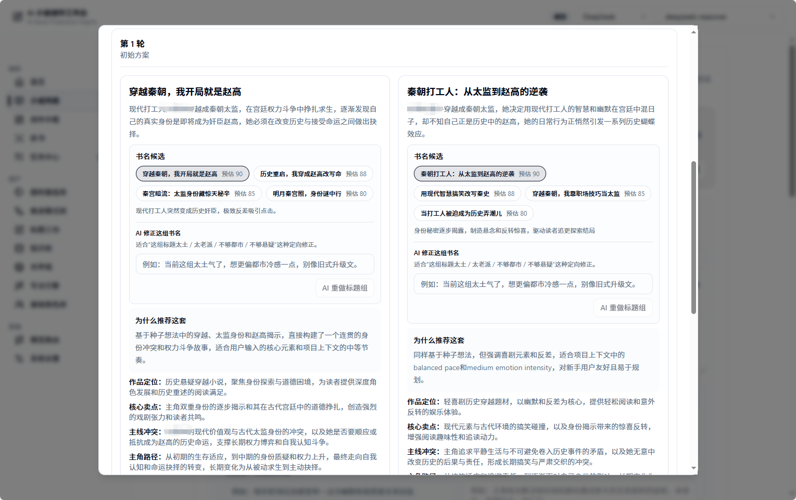


### 项目设定

先把题材、卖点、读者预期和前 30 章承诺讲清楚，再把后续规划和生成都建立在同一条开书控制轴上。

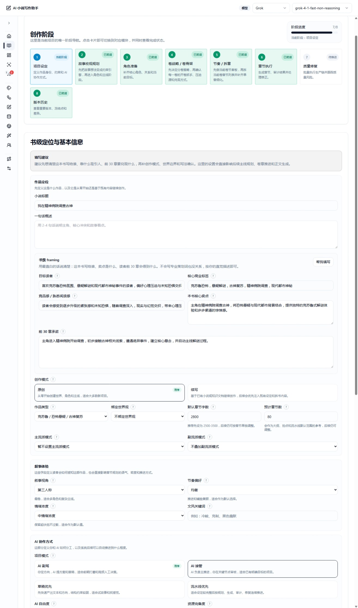

### 故事宏观规划

从整本走向、阶段升级和长线兑现出发，先把长篇主线搭稳，再继续卷级和章节级规划。

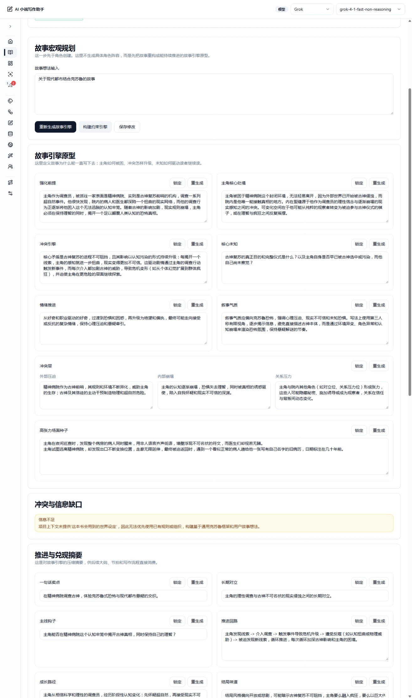

### 角色准备

围绕主角团、关系网和卷级职责做角色准备，减少开书后角色断档、功能位缺失和关系推进失速。

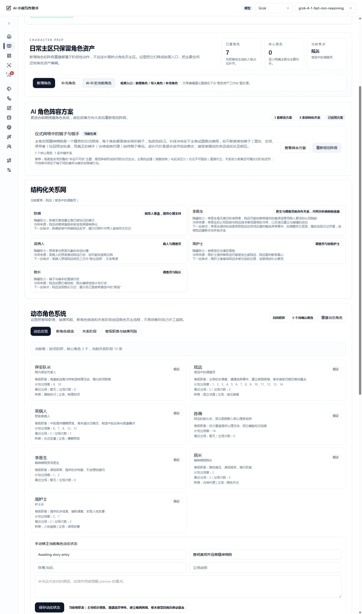

### 卷战略 / 卷骨架

先决定怎么分卷、哪些卷要硬规划，再把每卷使命、升级节点和卷尾钩子钉稳。

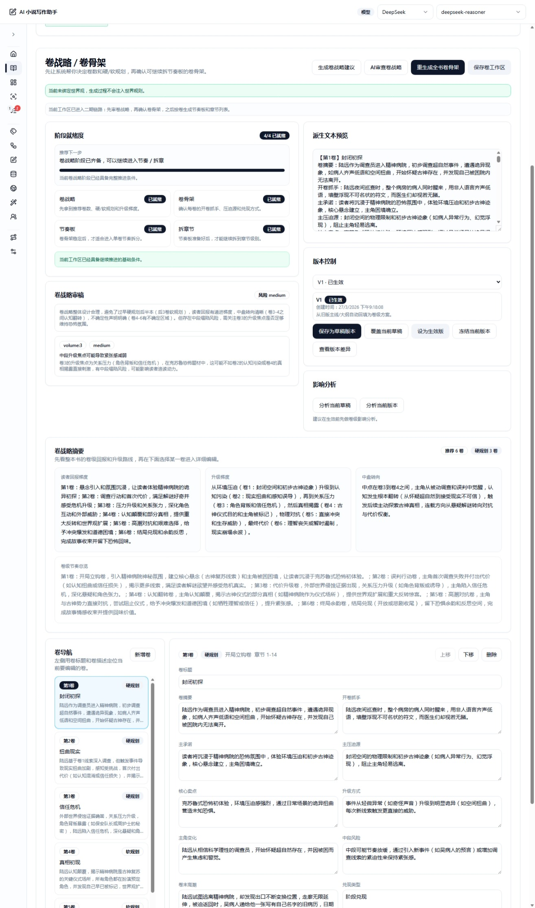

### 节奏 / 拆章

先看当前卷节奏，再把节奏落实成章节列表和单章细化，卷内推进链路更适合连载网文的追读节奏。

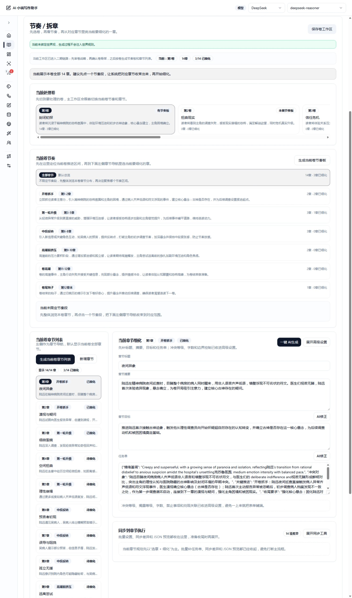

### 章节执行

章节执行页把章节导航、当前结果和 AI 快捷操作放进同一工作流里，适合逐章推进、审计和修复。

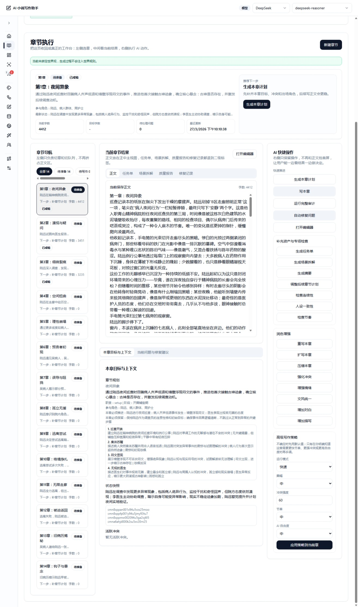

### 正文修改

在正文编辑页里直接回看当前章、修正文案，并继续衔接任务单、审计结果和修复链路。


### 小说列表

从这里进入开书、管理、编辑和整本生产。


### 拆书分析

把参考作品拆成结构化知识，再回灌给后续创作链路。


### 知识库

统一管理文档、索引、重建任务和检索能力。

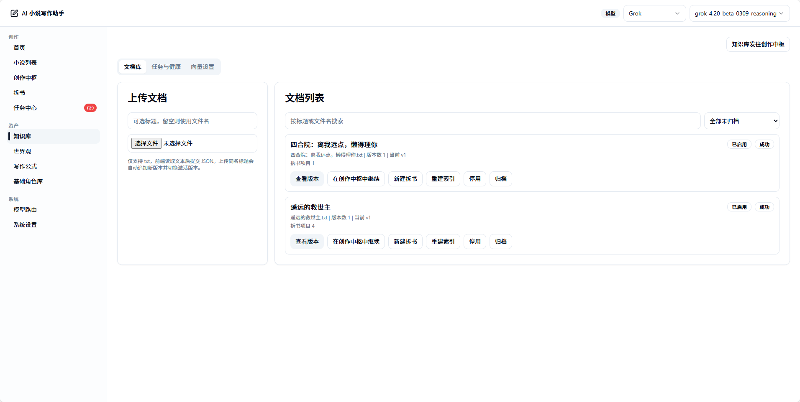

### 世界观

世界观不再只是描述文本，而是能被绑定、检查和持续维护的结构化资产。


### 角色库

统一维护角色基础档案与小说内角色信息。

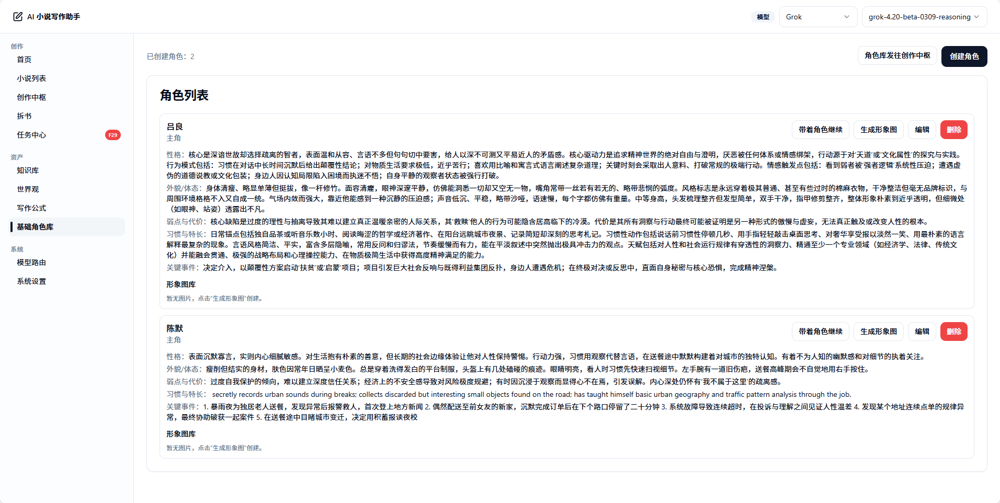

### 类型管理

集中维护题材与类型资产，让故事规划、角色准备和正文生成共享同一套题材语言。


### 流派管理

把推进模式、兑现方式和冲突边界收成可复用的流派模式资产，让整本书更容易保持读者预期。


### 标题工坊

批量生成、筛选和微调书名与标题方向，降低新手在开书命名阶段的试错成本。

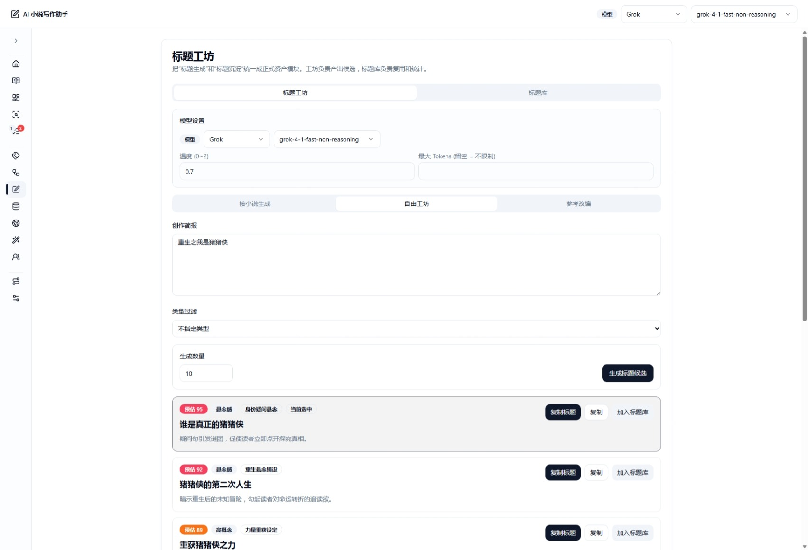

### 写法引擎与反 AI 规则

统一管理写法资产、风格约束和反 AI 规则，让正文更像作品本身，而不是模板式补全文本。

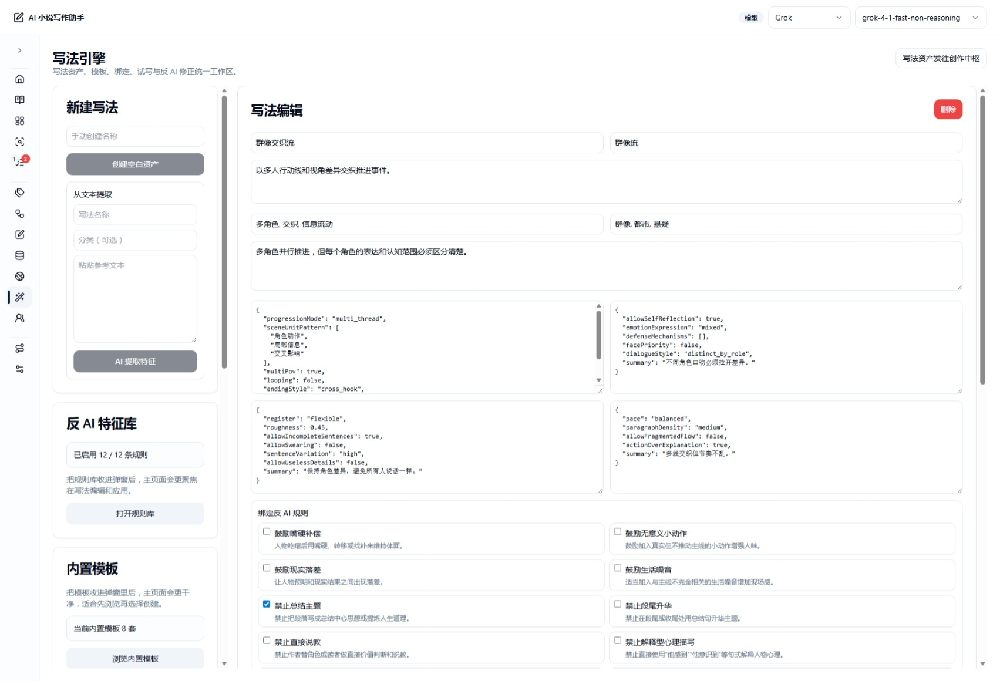

### 任务中心

查看拆书、知识库重建和其他后台任务的排队、执行与失败状态。

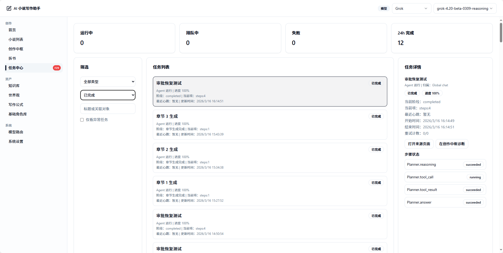

### 模型配置

为不同能力配置不同模型，减少一套模型硬吃所有任务的成本。


## 快速开始

### 环境要求

- Node.js `>= 20`
- pnpm `>= 9.7`
- 至少一组可用的 LLM API Key
  也可以先把项目跑起来，再在页面里配置
- 如果你要完整体验知识库 / RAG，再额外准备可用的 Qdrant

### 1. 安装依赖

```bash
pnpm install
```

### 2. 配置环境变量

这个仓库通过 pnpm workspace 分别启动前后端，所以环境变量也是按子包读取的：

- 服务端运行在 `server/` 工作目录，默认读取 `server/.env`
- 前端运行在 `client/` 工作目录，默认读取 `client/.env` / `client/.env.local`
- 根目录 `.env.example` 目前更适合当“总览参考”，不是 `pnpm dev` 默认读取的主入口

#### 2.1 服务端环境变量

先复制服务端示例文件：

```bash
# macOS / Linux
cp server/.env.example server/.env

# Windows PowerShell
Copy-Item server/.env.example server/.env
```

最少建议先确认这些项目：

- `DATABASE_URL`
  默认就是本地 SQLite，可直接使用
- `RAG_ENABLED`
  如果你暂时不接知识库，建议先设为 `false`
- `QDRANT_URL`、`QDRANT_API_KEY`
  只有要启用 Qdrant / RAG 时才需要

注意：

- `OPENAI_API_KEY`、`DEEPSEEK_API_KEY`、`SILICONFLOW_API_KEY` 这类变量可以先留空
- 项目启动后，也可以在页面中配置模型供应商和默认模型

#### 2.2 前端环境变量

大多数本地开发场景，其实不需要单独创建前端 env。

因为前端开发模式下默认会把 API 指到：

```text
http(s)://当前页面 hostname:3000/api
```

只有在这些场景下，才建议创建 `client/.env`：

- 前端和后端不在同一台机器
- 你想把前端显式指向别的 API 地址
- 你需要固定 `VITE_API_BASE_URL`

示例：

```bash
# macOS / Linux
cp client/.env.example client/.env

# Windows PowerShell
Copy-Item client/.env.example client/.env
```

内容通常只需要：

```env
VITE_API_BASE_URL=http://localhost:3000/api
```

#### 2.3 模型供应商并不一定要写死在 env

当前项目已经支持在页面里配置模型相关设置：

- `/settings`
  配置供应商 API Key、默认模型、连通性测试
- `/settings/model-routes`
  给不同任务分配不同 provider / model
- `/knowledge?tab=settings`
  配置 Embedding provider、Embedding model、集合命名和自动重建策略

所以环境变量里的 `OPENAI_MODEL`、`DEEPSEEK_MODEL`、`EMBEDDING_MODEL` 等，更适合当作：

- 启动默认值
- 数据库里还没保存设置时的回退值

### 3. 启动开发环境

```bash
pnpm dev
```

默认情况下：

- 前端：`http://localhost:5173`
- 后端：`http://localhost:3000`
- API：`http://localhost:3000/api`

首次启动服务端时，会自动执行 Prisma generate 和 `db push`。

建议第一次启动后先做这几步：

1. 打开 `http://localhost:5173/settings`，至少配置一组可用的模型供应商 API Key
2. 打开 `http://localhost:5173/settings/model-routes`，检查各任务实际使用的模型路由
3. 如果要启用知识库，打开 `http://localhost:5173/knowledge?tab=settings`，保存 Embedding / Collection 设置

### 4. 如果你使用 Qdrant Cloud

如果你只是先体验主流程，其实可以先跳过 Qdrant，直接在 `server/.env` 里设：

```env
RAG_ENABLED=false
```

如果你要启用 Qdrant Cloud，可以按下面的最小流程来：

1. 到 [Qdrant Cloud](https://cloud.qdrant.io/) 注册账号。
2. 在 `Clusters` 页面创建一个集群。
   测试阶段用 Free cluster 就够了。
3. 集群创建完成后，到集群详情页复制 Cluster URL。
4. 在集群详情页的 `API Keys` 中创建并复制一个 Database API Key。
   这个 key 创建后通常只展示一次，建议立即保存。
5. 把它们写入 `server/.env`：

```env
QDRANT_URL=https://your-cluster.region.cloud.qdrant.io:6333
QDRANT_API_KEY=your_database_api_key
```

6. 启动项目后，再去 `知识库 -> 向量设置` 页面选择 Embedding provider / model，并保存集合设置。

对这个项目来说，`QDRANT_URL` 建议直接填 REST 地址，也就是带 `:6333` 的地址。

如果你想手动验证连通性，可以用：

```bash
curl -X GET "https://your-cluster.region.cloud.qdrant.io:6333" \
  --header "api-key: your_database_api_key"
```

你也可以把集群地址后面拼上 `:6333/dashboard` 打开 Qdrant Web UI。

Qdrant 官方文档：

- [Create a Cluster](https://qdrant.tech/documentation/cloud/create-cluster/)
- [Database Authentication in Qdrant Managed Cloud](https://qdrant.tech/documentation/cloud/authentication/)
- [Cloud Quickstart](https://qdrant.tech/documentation/cloud/quickstart-cloud/)

### 5. 可选初始化

```bash
pnpm db:seed
pnpm db:studio
```

## 常用命令

```bash
pnpm dev
pnpm build
pnpm typecheck
pnpm lint
pnpm db:migrate
pnpm db:seed
pnpm db:studio
pnpm --filter @ai-novel/server test
pnpm --filter @ai-novel/server test:routes
pnpm --filter @ai-novel/server test:book-analysis
```

## 技术栈与架构

### 技术栈

| 层级 | 技术 |
| --- | --- |
| 前端 | React 19、Vite、React Router、TanStack Query、Plate |
| 后端 | Express 5、Prisma、Zod |
| AI 编排 | LangChain、LangGraph |
| 数据库 | SQLite |
| RAG | Qdrant |
| 工程形态 | pnpm workspace Monorepo |

### Monorepo 结构

```text
client/   React + Vite 前端
server/   Express + Prisma + Agent Runtime + Creative Hub
shared/   前后端共享类型与协议
images/   README 与产品预览截图
scripts/  启动和辅助脚本
docs/     设计文档、阶段检查点、模块计划与历史归档
```

更细的文档分区说明可以看 [docs/README.md](./docs/README.md)。

### 当前系统关注点

- `Creative Hub` 负责统一创作中枢与 Agent 运行时体验
- `Novel Setup / Director` 负责从一句灵感走到整本可写
- `Novel Production` 负责整本生成主链
- `Style Engine` 负责写法资产、特征提取、绑定和反 AI 协同
- `Knowledge / Book Analysis / World` 负责长期上下文沉淀与回灌

## 当前路线图

当前最重要的不是继续堆零散功能，而是提高“小白把整本书写完”的成功率。

### P0

- 把自动导演、Novel Setup、整本生产主链进一步收拢成稳定闭环
- 让用户从一句灵感进入“整本可写”状态
- 降低新手在写法、世界观、角色和章节规划上的认知负担

### P1

- 提高整本一致性、节奏稳定性和人物成长质量
- 让写法资产、世界观约束、章节重规划和审阅反馈形成闭环
- 让系统更擅长“持续掌控整本书”，而不只是“生成某一章”

### P2

- 继续强化多阶段 Agent 协同
- 完善更自动化的生产调度、回合记忆和整本质量控制

## 贡献方式

如果你想参与这个项目，最有价值的贡献方向包括：

- 提升整本生产稳定性
- 改善新手开书体验和自动导演成功率
- 强化写法引擎、知识库回灌和世界观一致性链路
- 补充测试、错误回放和运行时可观察性

欢迎直接提 Issue 或 Pull Request。

## 说明

- 这是一个持续快速迭代中的 AI Native 创作系统，功能边界仍在演化。
- README 优先描述当前最值得体验、最能代表方向的能力，而不是列出全部历史实现细节。
- 如果你更关心阶段目标、优先级和后续优化计划，请直接查看 [TASK.md](./TASK.md)。

## 这是对AI完全接入项目开发的一次尝试
## 项目中所有代码都是AI编写
## 目标：只需要进行书名配置 和 点击确认按钮 即可生成（理想）小说
# 
## License

This project is licensed under the MIT License. See [LICENSE](./LICENSE) for details.
