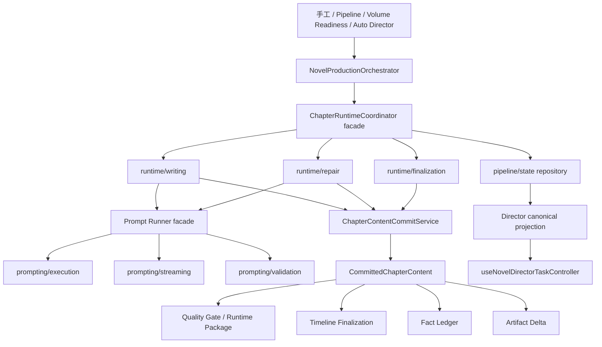

# 小说生产主链审查问题全量修复设计

## 背景

本次生产级审查确认了七类直接风险和一类结构性风险：

1. Prompt 流式执行会同时 reject 文本与 usage Promise，usage 在文本失败路径中没有 rejection owner，可能触发未处理拒绝并退出 Node 进程。
2. 章节修文候选基于旧正文生成，采纳时未校验 `contentRevision`，可能覆盖修文期间发生的人工编辑。
3. 自动导演把连续五章 `defer_and_continue` 或 no-generatable defer 提升为全书任务失败，违反局部质量债继续推进规则。
4. 手工审核路径只判断 `replanRecommendation.recommended`，会把 `local_patch_plan` 执行成真实邻章重规划。
5. humanizer 改写正文持久化失败后，时间线、事实账本、runtime package 和 artifacts 仍消费未落库文本，形成多事实源。
6. pipeline 取消运行中任务时没有终态 CAS，可能覆盖并发写入的 `succeeded`。
7. 章首多样性 Prompt 内联在 runtime 中，绕开 Prompt Registry，且治理测试未进入 fast CI。
8. Prompt Runner、pipeline executor、自动导演 runtime、共享 director 类型和 `NovelEdit` 已超过项目硬性文件阈值，关键策略与基础设施职责继续耦合。

用户选择采用结构优先的方案 C：先建立明确模块边界，再在新边界内逐项修复所有生产语义问题。所有工作位于分支 `codex/fix-novel-production-review-findings`，不直接修改主工作树。

## 目标

- 保证所有 Prompt 流中断、超时和取消路径都有唯一且完整的 Promise 所有权，不产生未处理拒绝。
- 保证 AI 修文和定稿改写不能覆盖并发人工正文，所有派生事实只来自成功提交的正文快照。
- 保证局部质量债保持章节级警告，不自动失败全书主链，也不隐式触发邻章重规划。
- 保证 pipeline 的取消、成功、失败、租约丢失和恢复使用同一套原子状态转换规则。
- 把章首多样性 Prompt 纳入 Prompt Registry，并让静态治理测试成为 fast CI 门禁。
- 将本次涉及的超长文件拆到责任清晰的目录，稳定 facade 只暴露公共能力。
- 删除能够确认没有生产调用的旧兼容门面。
- 保持手工单章、批量 pipeline、Volume Readiness 和自动导演继续汇入统一章节 runtime。

## 非目标

- 不新增关键词路由、正则意图识别或非 AI 产品决策 fallback。
- 不改变小说写作 Prompt 的创作目标、质量阈值或用户可见工作流，除非修复所列错误语义必须改变。
- 不重写 Prisma schema，不执行数据迁移、数据删除或数据库重置。
- 不把 Creative Hub 扩展为通用聊天入口。
- 不在本阶段把整个 `server/src` 一次性迁移到 `modules/`；只处理本次修改触及的清晰责任边界。
- 不用新的兼容层掩盖旧门面；确认无调用的门面直接删除。

## 总体原则

### 单一事实源

- 章节正文的事实源是成功提交后返回的 `{ content, contentRevision }` 快照。
- runtime package、质量评分、时间线、事实账本、artifact delta 和 SSE 最终结果只能消费该快照。
- task/runtime/UI 状态由后端 canonical task 和 projection 派生；`workspaceTaskId` 不参与 director task 仲裁。

### 单一章节执行链

- 控制入口继续经 `novelProductionOrchestrator` 与 `ChapterExecutionStageRunner`。
- 正文生成、修复、定稿、时间线提交和产物调度继续由 `ChapterRuntimeCoordinator` 内部模块协作。
- 新拆模块是 runtime 内部责任模块，不允许 route、director 或旧 service 直接深链。

### 结构化 AI 决策优先

- `local_patch_plan`、`continue_with_warning` 和 `defer_and_continue` 直接依据结构化 action 处理。
- 只有 `stop_for_replan`、`replan_required` 或 `recommendedAction=replan` 可触发重规划或停止全局链。
- 不通过字符串匹配或额外布尔 fallback 改写结构化 AI 决策。

### 原子状态转换

- 正文提交、pipeline 终态、取消请求和租约所有权都使用带预期状态的 CAS。
- CAS miss 必须重新读取 canonical 状态并返回冲突、既有终态或租约丢失，不允许无条件覆盖。

## 目标架构



## 子系统一：Prompt 执行平台

### 当前职责问题

`server/src/prompting/core/promptRunner.ts` 同时负责注册校验、上下文选择、slot/template overlay、同步执行、流式执行、structured repair、semantic retry、质量遥测、usage 合并和 live session。流文本与流结构化路径复制 completion 组装逻辑，导致 usage Promise 只有成功路径消费者。

### 目标目录

```text
server/src/prompting/
  core/
    promptRunner.ts                  # 稳定 public facade 与测试注入入口
    promptTypes.ts
  execution/
    PromptExecutionPreparation.ts    # registry、context、slot/template、invocation meta
    TextPromptExecutor.ts            # 非流式 text
    StructuredPromptExecutor.ts      # 非流式 structured
  streaming/
    PromptStreamCapture.ts           # iterator、timeout、abort、单 completion Promise
    TextPromptStreamExecutor.ts       # 流式 text public implementation
    StructuredPromptStreamExecutor.ts# 流式 structured public implementation
  validation/
    PromptPostValidation.ts          # text postValidate 与失败分类
    StructuredOutputResolution.ts    # parse/repair/semantic retry
  observability/
    PromptExecutionRecorder.ts       # completion/failure/usage/live session 记录
```

`promptRunner.ts` 继续导出：

- `preparePromptExecution`
- `runTextPrompt`
- `runStructuredPrompt`
- `streamTextPrompt`
- `streamStructuredPrompt`
- 现有两个测试注入 setter

外部调用方无需改为深 import。

### 流完成协议

内部只允许一个完成 Promise：

```ts
interface CapturedPromptStreamCompletion {
  text: string;
  usage: LlmTokenUsageSnapshot | null;
}

interface CapturedPromptStream {
  stream: AsyncIterable<BaseMessageChunk>;
  completion: Promise<CapturedPromptStreamCompletion>;
}
```

- iterator 正常结束时一次 resolve。
- timeout、abort 或 iterator error 时一次 reject。
- 不再创建第二个可独立 reject 的 usage Promise。
- iterator `return()`、timeout timer 和 abort listener 在 `finally` 中释放。
- `controller.abort()` 的同步 try/catch 只作为防御，不能被描述为 rejection 处理方案。

### Prompt Registry 迁移

- 新建 `server/src/prompting/prompts/novel/openingDiversity.prompts.ts`。
- 资产 ID 保持 `novel.chapter.opening_diversity_rewrite@v1`。
- `openingDiversity.ts` 只负责相似度检测、防回归比较和调用 `runTextPrompt`。
- 在 `registry.ts` 注册资产。
- `prompting-governance.test.js` 的静态扫描移入 fast 集合；现有 audiobook 违规不在本小说修复中静默加入 allowlist，应单独迁移或让治理测试继续明确失败。为了使分支可合并，本阶段将同时迁移测试报告中的 audiobook inline prompt，但不改变其产品语义。

## 子系统二：章节正文提交与定稿

### 目标目录

```text
server/src/services/novel/runtime/
  ChapterContentFinalizationService.ts  # 保留现有 import path 的稳定 facade
  content/
    ChapterContentCommitService.ts   # 正文 CAS 与稳定快照
    ChapterContentCommitTypes.ts
  finalization/
    ChapterContentFinalizationOrchestrator.ts # 定稿编排实现
    ChapterStyleReviewFinalizer.ts    # humanizer 与改写提交
    ChapterQualityProjectionService.ts# quality score/risk flags/runtime package
    ChapterFactProjectionService.ts   # fact ledger accepted/excluded
    ChapterTimelineProjectionService.ts# timeline 调度
  repair/
    ChapterRepairStreamRuntime.ts     # 保留现有 import path 的稳定 facade
    application/
      ChapterRepairStreamOrchestrator.ts
      ChapterRepairFinalizer.ts
    concurrency/
      ChapterRepairLock.ts
    evaluation/
      ChapterRepairBaselineEvaluator.ts
      ChapterRepairIssueResolver.ts
```

### 提交类型

```ts
interface CommittedChapterContent {
  novelId: string;
  chapterId: string;
  content: string;
  contentRevision: number;
}

interface CommitChapterContentInput {
  novelId: string;
  chapterId: string;
  content: string;
  expectedContentRevision: number;
  statePatch?: Prisma.ChapterUpdateManyMutationInput;
  source: "generation_draft" | "style_rewrite" | "repair_adopt";
}
```

`commit()` 使用 `updateMany`，条件包含 `id`、`novelId`、`contentRevision`，成功后 reload 并返回稳定快照。count 为 0 时：

1. 重新读取章节。
2. 不存在则抛章节不存在。
3. revision 不匹配则抛 `CHAPTER_CONTENT_CONFLICT`。
4. 不把冲突包装成普通质量失败。

现有系统权威 last-write-wins 写入口不会被偷偷改成 CAS；只有本次明确需要保护的 repair adopt 和 style rewrite 进入新 CAS 边界。后续可单独评估初始 draft 是否也必须捕获起始 revision。

### Repair 数据流

1. repair 创建时读取正文、`contentRevision`、repairHistory 和风险字段。
2. 生成候选始终绑定该 baseline revision。
3. baseline/candidate 使用同协议 evaluateOnly。
4. discard/plateau 只允许更新不涉及正文的 repairHistory，并避免覆盖并发更新后的 history；必要时用独立 history append repository。
5. adopt 使用 baseline revision CAS 提交正文和状态。
6. CAS 冲突输出结构化 concurrent-edit frame，Volume Readiness 映射为可恢复的 `skipped_locked`/`repair_incomplete`，不得输出 adopted。
7. 只有成功提交的 snapshot 才能进入 recheck、artifact sync 和 timeline finalization。

### Finalization 数据流

1. writer 已通过 `saveDraftAndArtifacts` 保存原始 draft；该方法返回提交后的 revision。
2. revision 随 finalized input 传入。
3. humanizer 不改写时，原 draft snapshot 直接成为 canonical final content。
4. humanizer 改写时，用 draft revision CAS 提交改写稿。
5. CAS 冲突或数据库错误时，finalization 失败并保持可恢复，不生成 timeline、fact 或 artifact 投影。
6. quality gate、runtime package、SSE 最终正文和所有派生任务只接收 `CommittedChapterContent.content`。

## 子系统三：Pipeline 和自动导演状态机

### Pipeline 目标目录

```text
server/src/services/novel/pipeline/
  execution/
    PipelineJobExecutor.ts            # 顶层章节循环
    PipelineChapterExecution.ts       # 单章 runtime 调用与 stage 回调
  state/
    PipelineJobStateRepository.ts     # queued/running/finalizing/terminal CAS
    PipelineJobLeaseService.ts        # claim/heartbeat/lease-lost
    PipelineJobCancellationService.ts # cancel request 与终态仲裁
  quality/
    PipelineChapterQualityPolicy.ts   # 本章债务与继续策略
    PipelineReplanPolicy.ts           # 只有显式 replan 才停
  recovery/
    PipelineJobRecoveryPolicy.ts      # transport retry / requeue / startup resume
  pipelineExecute.ts                  # 兼容 facade，仅委托 executor
```

`NovelCorePipelineService.cancelPipelineJob()` 委托 `PipelineJobCancellationService`：

- queued：`status=queued` CAS 到 terminal cancelled。
- running：只在 `status=running` 时写 cancel-requested 状态；不得覆盖 succeeded/failed。
- CAS miss：reload canonical row；终态直接返回/报告不可取消，不修改字段。
- pipeline 自身在检查点读取 cancel request 并完成取消终态。
- 租约 owner 存在时，所有 running/finalizing 写入都带 owner 条件。

### 自动导演目标目录

```text
server/src/services/novel/director/automation/
  application/
    NovelDirectorAutoExecutionRuntime.ts # facade 与顶层循环
    AutoExecutionRangeRunner.ts
  domain/
    AutoExecutionProgressPolicy.ts       # cursor/remaining/no-progress
    AutoExecutionQualityDebtPolicy.ts    # defer/local debt
    AutoExecutionStopPolicy.ts           # 明确全局停止原因
  projections/
    AutoExecutionTaskProjector.ts        # checkpoint/task state 同步
  infrastructure/
    AutoExecutionPipelineGateway.ts
```

现有对外类名与构造依赖保持稳定，但执行循环只组合上述策略。

### 质量债规则

- 删除 `MAX_CONSECUTIVE_DEFERS` 及其 `markTaskFailed` 分支。
- 每次 defer 后比较 `nextChapterId`、`nextChapterOrder`、`remainingChapterCount` 和已完成 checkpoint。
- cursor 前进即属于有效进展，无论连续多少章存在局部债务，都继续执行。
- cursor 未变化才累加 no-progress 计数；达到保护阈值属于 runtime safety failure，并记录具体 cursor 快照。
- `local_patch_plan`、`continue_with_warning`、`defer_and_continue` 只进入质量债投影。
- `stop_for_replan`、`replan_required`、`recommendedAction=replan` 才进入全局 stop/replan。

### 手工审核重规划

新增纯函数 `shouldExecutePlannerReplan(decision)`，只接受明确 replan action。`reviewChapter()`：

- local patch：记录修复指导，不调用 Planner。
- stop/replan：调用 Planner，并让失败显式传播或写入结构化可恢复状态。
- 不再用 `recommended` 布尔值代替 action。

## 子系统四：Shared 类型与前端事实源

### Shared 类型拆分

```text
shared/types/director/
  artifacts.ts
  runtime.ts
  projections.ts
  dashboard.ts
  commands.ts
  workspace.ts
  index.ts
shared/types/directorRuntime.ts # 仅 re-export，保持现有包入口
```

拆分不改变字段名、序列化 shape 或外部 import 路径。新服务内部可逐步从 owned module import，客户端仍可从稳定 facade 导入。

### NovelEdit 拆分

```text
client/src/pages/novels/
  NovelEdit.tsx                         # route shell，目标小于 700 行
  hooks/
    useNovelWorkspaceQueries.ts
    useNovelPipelineController.ts
    useNovelDirectorTaskController.ts
    useNovelTaskDrawerController.ts
    useNovelEditPresentationModel.ts
  automation/
    directorTaskSelection.ts            # 纯函数 canonical task 仲裁
    directorTaskActions.ts
```

`useNovelDirectorTaskController` 是前端唯一 director task 仲裁入口，输入包括：

- URL `directorTaskId`
- active auto-director task
- book automation projection/latest task
- requested task query
- task panel open 状态

它输出：

- canonical director task id
- visible director task
- action target task id
- autofocus/recovery 决策
- query invalidation keys

接口不接受 `workspaceTaskId`。手工 workspace lane 保持独立，只用于 workspace 工作流。

`NovelEdit.tsx` 只负责组装 controller、页面级表单状态和向 `NovelEditView` 传 props，不再直接实现 task 仲裁和大批 mutation。

根据项目验证规则，本阶段只运行 client typecheck 和现有纯函数/Hook 单测；浏览器与视觉验收由用户完成。

## 子系统五：清理与治理

### 删除内容

- 删除 `server/src/services/novel/NovelReviewService.ts`。
- 删除 `server/src/services/novel/NovelArtifactService.ts`。
- 清理边界测试中的文件名单和当前架构 wiki 中的兼容层枚举。
- 历史 archive 文档保留历史事实，不为删除动作重写。

`NovelGenerationService`、`NovelPipelineService` 和 `NovelService` 暂不删除，因为仍有测试和明确 facade 合同；后续只有在测试迁移和仓库外调用确认完成后另行处理。

### Wiki

更新以下稳定知识：

- `docs/wiki/workflows/chapter-production-chain.md`：正文提交快照、CAS 和派生事实顺序。
- 自动导演相关 wiki：局部质量债与 no-progress safety failure 的区别。
- `docs/wiki/prompts/` 或 prompting README：单一 stream completion ownership 与 Registry 规则。
- `docs/wiki/architecture/module-boundaries.md`：新目录 facade 和依赖方向。

### Release Notes

设计文档提交是内部开发文档，不更新用户 release notes。生产修复阶段完成后，按当日日期合并一条用户视角更新，描述：章节编辑不再被后台修文覆盖、自动成书不会因局部质量问题提前停止、任务取消与恢复更可靠。

## 测试设计

所有行为修改遵循 RED-GREEN-REFACTOR。结构搬迁先运行现有 contract 测试证明行为未变；随后每个问题先添加失败测试。

### Prompt

- 子进程测试：真实触发 stream abort，断言进程退出码为 0 且无 `unhandledRejection`。
- timeout 与 upstream abort 分别覆盖 text/structured。
- 验证 iterator `return()`、timer 和 listener 清理。
- registry/governance 测试验证 opening diversity 和 audiobook 资产均注册。

### 正文提交

- repair revision N 生成候选，人工保存到 N+1，adopt CAS miss，人工正文保留。
- style rewrite 持久化失败，timeline/facts/artifacts 均不调用。
- style rewrite CAS 成功后，所有派生服务收到与数据库一致的正文和 revision。
- discard/plateau 不改正文。

### Pipeline/Director

- cancel 初读 running，随后 succeeded，取消 CAS 不得覆盖终态。
- queued 到 running 竞态仍由 running cancellation path 接管。
- 六章连续 defer 且 cursor 前进：workflow 不失败并继续下一章。
- cursor 连续不变：触发 runtime no-progress safety failure。
- `local_patch_plan` 不调用 Planner；`stop_for_replan` 调用一次。

### Frontend/Shared

- task selection 纯函数覆盖 URL task、active task、book projection failed/blocked/waiting_recovery。
- 无 URL task 时仍展示最新可恢复 director task。
- `workspaceTaskId` 无法进入 director task selection API。
- shared/server/client typecheck 验证拆分后的 re-export shape。

### 删除与边界

- `git grep` 不再出现被删除门面生产引用。
- 边界测试直接验证 application capability 和 runtime facade。
- 新测试优先直接命中新 owned module，不只调用兼容 facade。

## 实施阶段与提交边界

### 阶段 0：设计与计划

- 提交本设计文档。
- 用户确认文档后编写逐步实施计划。

### 阶段 1：Prompt 平台结构和修复

- 先拆 Prompt Runner，保持公共 API。
- 添加 stream rejection 失败测试并修复。
- 迁移 opening diversity 与治理测试中的 audiobook Prompt。
- 更新 Prompt wiki。

### 阶段 2：章节正文提交、修文和定稿

- 建立 commit service。
- 拆 repair/finalization 职责。
- 添加 CAS 和事实源失败测试并修复。
- 更新章节生产 wiki。

### 阶段 3：Pipeline 与自动导演状态机

- 拆状态 repository、执行器与领域策略。
- 添加取消竞态、local patch、连续 defer/no-progress 测试并修复。
- 更新恢复和质量债 wiki。

### 阶段 4：Shared 类型和前端控制器

- 拆 shared director 类型。
- 提取 NovelEdit controllers，统一 director task 仲裁。
- 运行 shared/client typecheck 与纯函数测试。

### 阶段 5：删除、综合验证和发布记录

- 删除两个确认无调用门面。
- 运行最终 grep、typecheck、定向 fast/integration 测试。
- 更新 release notes 与 README 最新更新。

每个阶段只包含该阶段的代码、测试和稳定文档，验证通过或明确记录验证缺口后独立提交。

## 错误与恢复语义

- `CHAPTER_CONTENT_CONFLICT`：可恢复并发冲突，不写正文、不生成派生事实、不标记 adopted。
- Prompt abort/timeout：原错误传播到调用方，释放流资源，不产生未处理拒绝。
- Pipeline cancel CAS miss：返回当前 canonical terminal state，不覆写。
- `local_patch_plan`/`defer_and_continue`：章节质量债，任务继续。
- no-progress safety failure：必须包含 cursor、remaining 和 checkpoint 证据，才允许失败全局任务。
- timeline/fact/artifact 调度失败：沿用既有可恢复策略，但前提是正文已成功提交；正文未提交时禁止调度。

## 风险与控制

- **结构搬迁风险**：每个 facade 先保持原 public export，运行现有 tests/typecheck 后再改行为。
- **测试 mock 掩盖真实错误**：新增测试必须断言 DB 提交与副作用调用，禁止只断言内存返回值。
- **跨阶段分支漂移**：每阶段提交前检查 HEAD、status 和 diff，只提交本阶段文件。
- **大范围 UI 回归**：控制器提取保持现有 view props；不做视觉重设计，用户完成 UI 验收。
- **兼容层继续扩散**：拆分 facade 仅作为稳定模块入口，不添加 deprecated wrapper；确认无调用的旧门面直接删除。

## 验收标准

- 所有七个生产 finding 都有一个曾经失败、修复后通过的自动化回归测试。
- Prompt abort/timeout 子进程测试证明无未处理拒绝和进程退出。
- repair/manual edit 竞态证明人工 revision 不被覆盖。
- finalization 持久化失败证明没有 timeline/fact/artifact 消费未提交文本。
- 连续局部质量债不会失败全书；无进展保护仍能阻止真实死循环。
- pipeline cancel 不会覆盖并发 succeeded。
- Prompt governance fast suite 通过。
- `NovelEdit.tsx`、`promptRunner.ts`、`pipelineExecute.ts`、自动导演主 runtime 和 shared director facade 均降到 700 行以内，或 facade 本身只保留稳定入口且实现文件各自低于硬阈值。
- 两个确认无调用门面及其当前边界名单被删除。
- shared、server、client 的相关 typecheck 和定向测试通过。
- Wiki 记录新的正文提交、质量债、恢复和 Prompt 边界。
