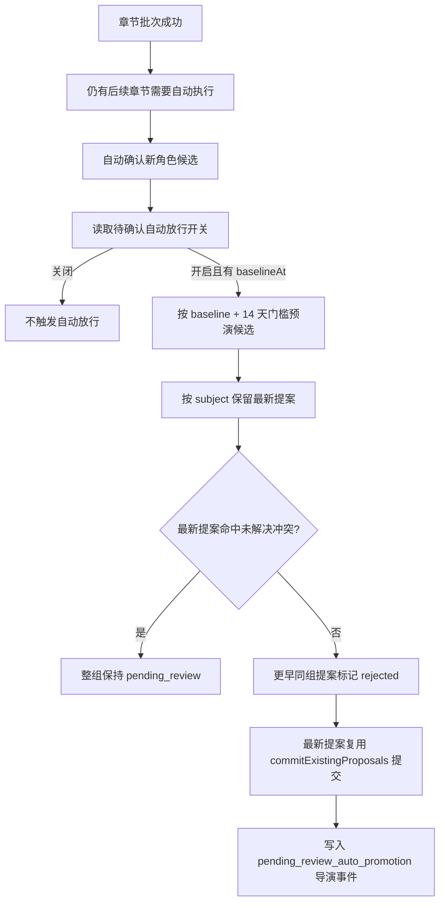

# 待确认状态提案自动放行

## Background

`relation_state_update` 和 `information_disclosure` 属于状态提案里的人工审核类型。它们影响角色关系推进、角色/读者对信息的认知状态，长期停留在 `pending_review` 会削弱后续章节对关系变化和信息揭示的连续性。

自动放行的目标不是取消人工审核，而是给“开启之后新产生、等待足够久、没有命中未解决冲突”的低风险提案提供受控提交路径。该能力默认关闭，关闭时系统行为与没有这项能力一致。

## Decision

自动放行必须同时满足四个边界：

- 默认关闭，任何环境拉取代码后不会自动处理待确认提案。
- 首次开启时记录 `baselineAt`，只处理 `createdAt > baselineAt` 的新提案。
- 开启需要服务端校验确认凭证，不能通过普通 toggle 误触。
- 每次执行必须写入导演事件留痕，记录提交、覆盖、跳过和判定依据。

## Current Rule

可处理类型仅限：

- `relation_state_update`
- `information_disclosure`

候选门槛：

- 提案状态必须是 `pending_review`。
- `createdAt` 必须晚于设置里的 `baselineAt`。
- 提案创建时间距离当前时间至少 14 天。
- 同一 subject 只处理最新提案；同组更早提案只在最新提案可放行时标记为 `rejected`，原因写入“已被更新提案覆盖”。
- 最新提案命中未解决冲突时，整组保持 `pending_review`。
- 单次运行有处理上限，避免异常场景批量提交过多提案。

subject 分组规则：

- `relation_state_update`：`sourceCharacterId + targetCharacterId`
- `information_disclosure`：`holderType + holderRefId + fact`

冲突跳过规则：

- 同章节未解决冲突命中候选提案。
- 冲突记录的 `affectedCharacterIdsJson` 命中候选提案相关角色。
- 信息认知提案的 `fact` 命中冲突标题、摘要、key、证据或处理建议。

## Runtime Flow

自动导演接入点是章节批次成功后的后台维护动作，采用 fire-and-forget 调用。失败不会改变章节生成、质量修复、暂停或继续执行的控制流。

## Settings Contract

设置保存在 `AppSetting`：

- `qualityDebt.pendingReviewAutoPromotion.enabled`
- `qualityDebt.pendingReviewAutoPromotion.baselineAt`

`baselineAt` 只在第一次开启时写入。关闭后再次开启不会覆盖该时间，避免把更早的存量提案纳入自动处理范围。设置页必须持续展示开启状态和基准时间。

## Trace Contract

每次非 dry-run 执行都会记录 `DirectorEvent.type = pending_review_auto_promotion`。metadata 至少包含：

- 判定门槛：baseline、14 天 age gate、run limit、proposal types。
- promoted proposal ids。
- superseded proposal ids。
- conflict skipped records。
- run-limit deferred proposals。
- executedAt。

这条事件用于后续解释“某条关系/认知状态为什么被自动提交”，也为人工复核或未来反向辅助工具提供依据。

## Failure Modes

- **baseline 丢失**：即使 `enabled = true`，没有 `baselineAt` 也视为不可执行。
- **冲突检测过宽**：候选会继续停留在 `pending_review`，不会污染正史，但积压仍需人工处理。
- **冲突检测过窄**：提案可能被提交。风险通过默认关闭、14 天等待、留痕和 run limit 控制。
- **长期无人处理队列**：未命中自动放行条件的提案仍会积压，需要后续批量复核入口或人工工作台解决。

## Related Modules

- `server/src/services/settings/QualityDebtSettingsService.ts`
- `server/src/services/novel/state/PendingReviewAutoPromotionService.ts`
- `server/src/services/novel/state/stateProposalSubjectKey.ts`
- `server/src/services/novel/director/automation/novelDirectorAutoExecutionRuntime.ts`
- `server/src/services/novel/state/StateCommitService.ts`
- `server/src/services/state/OpenConflictService.ts`

